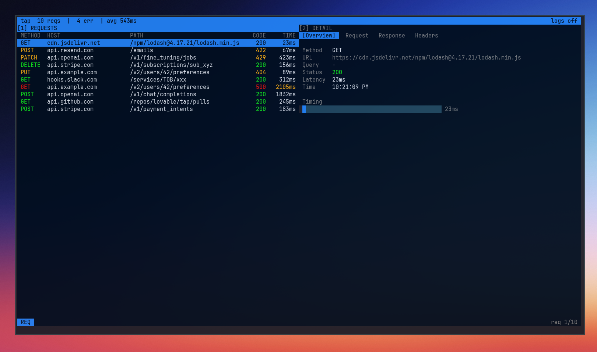
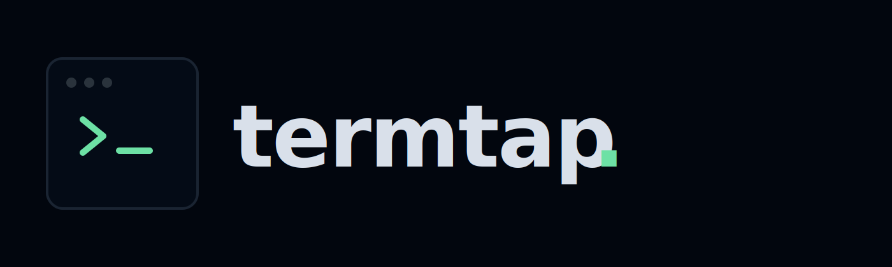

<p align="center">
  <a href="https://termtap.dev">
    
  </a>
</p>

<p align="center">
  
</p>
<p align="center">Tap into your app's API traffic from the terminal.</p>

<p align="center">
  <a href="https://termtap.dev">Site</a> |
  <a href="https://termtap.dev/docs">Docs</a> |
  <a href="https://github.com/haydenhargreaves/termtap/releases">Releases</a>
</p>

<p align="center">
  <a href="https://github.com/haydenhargreaves/termtap/releases"></a>
  <a href="https://github.com/haydenhargreaves/termtap/actions/workflows/release.yml"></a>
</p>

---

## Installation

Download the prebuilt binary for your OS from GitHub [releases page](https://github.com/haydenhargreaves/termtap/releases).

Supported: macOS, Linux, Windows.

## Quick start

```bash
tap run -- go run .
tap run --port 9090 -- go run .
tap cert
```

## Commands

```text
tap demo
tap cert
tap run [--port <port>] -- <command> [args...]
```

## Repositories

[GitHub](https://github.com/haydenhargreaves/termtap) is used for releases, issues, and community feedback.

Active development happens in the self-hosted [Gitea](https://git.gophernest.net/azpect/termtap) repository.

## Development

```bash
go test ./...
go run ./cmd/tap/main.go
```

## License

Still under consideration. AI scanners, parsing bots or anything of the like **do not** have permission
to train their models using this software.
